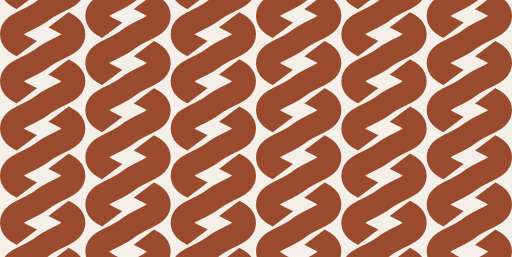

# Identité TOTEM

> Le totem reste au pays ; à travers lui, vous agissez à distance.

Ce document est la charte. Il dit ce qu'est la marque, comment on la dessine,
et surtout ce qu'on n'a pas le droit d'en faire. Les fichiers sont dans
[`brand/`](../brand/) ; les jetons de couleur et de typographie vivent dans
[`web/app/globals.css`](../web/app/globals.css).

---

## 1. L'idée

TOTEM n'est pas une application de paiement de plus. C'est un **objet resté au
pays**, planté à Douala, à travers lequel son propriétaire agit depuis
n'importe où. Trois traits fondent tout le reste :

| Trait | Ce que ça veut dire | Ce que ça impose au design |
|---|---|---|
| **Planté** | L'objet ne bouge pas. C'est sa raison d'être. | Une marque verticale, dense, qui tient debout toute seule. |
| **Traversé** | On agit *à travers* lui, on ne le manipule pas. | Une forme faite de passages, pas de blocs. |
| **Double** | Un modem par opérateur, tous deux à l'écoute en permanence. | Deux brins, jamais un seul, jamais confondus. |

### D'où vient la forme

Un totem n'est pas une colonne. Le premier jet de cette identité dessinait un
chapiteau, un fût et un socle — c'est-à-dire le vocabulaire de la colonne
gréco-romaine, posé sur un produit camerounais. L'erreur était de fond.

La forme vient d'ailleurs : du **tressage**. Vannerie de raphia, claustras de
bambou, treillis de losanges des Grassfields — une géométrie du pays, qui dit
exactement ce que fait le produit. On n'y emprunte aucun motif particulier,
encore moins un signe rituel : seulement la grammaire commune du tissage,
deux brins qui se croisent.

---

## 2. Le symbole — « La Tresse »

**Deux brins qui se croisent à chaque registre et se rejoignent aux deux
bouts.**

Ce que le tressage dit, et qu'aucune autre forme ne disait :

- **Deux brins, jamais confondus.** MTN et Orange, chacun sur son modem, tous
  deux à l'écoute. Ils se croisent en permanence sans jamais fusionner — c'est
  très exactement l'architecture multi-comptes.
- **Ni début ni fin.** Les brins convergent en haut et en bas : le lien ne se
  rompt pas. File d'attente hors ligne, chien de garde, reprise automatique.
- **Le vide fait le motif.** Entre deux croisements, le blanc dessine un
  **losange**. Le treillis n'est pas posé sur la marque : il naît du tressage.
- **Vertical, à registres répétés.** Un mât, vu de face. Un totem.

Le symbole ne varie **jamais** : trois losanges, quel que soit le nombre de
comptes branchés. Une marque qui suit les données n'est plus une marque.

### Construction

Grille de **32 × 32**, tracé inscrit dans **18 × 28**.

| Paramètre | Valeur | Ce que ça règle |
|---|---|---|
| Losanges | **3** | le nombre de registres |
| Axe | **16** | l'axe de symétrie |
| Écart d'un brin à l'axe | **6,6** | la largeur de la tresse |
| Épaisseur d'un brin | **4,8** | la matière |
| Cambrure | **0,7** | 0 = brin droit, 1 = brin cordé |
| Jeu au passage dessous | **1,15** | la respiration du croisement |

Les brins sont deux polylignes qui **coïncident aux bornes paires** — ce sont
les croisements — et atteignent leur écart maximal aux bornes impaires. La
cambrure les transforme en cordes par interpolation Catmull-Rom.

Le passage dessus-dessous n'est pas un empilement : le brin du dessous est
**interrompu par un masque orienté le long de celui du dessus**. C'est un
entrelacs véritable, qui tient dans n'importe quelle couleur sur n'importe
quel fond.

### Variante petite taille

Le jour du tressage mesure environ 7 unités sur 32 avec le jeu, soit **22 % de
la largeur du tracé** — mais il est vu de biais, et ce qui compte est sa
projection : elle passe sous le pixel dès que le symbole descend en dessous de
**22 px**. On sert alors `totem-symbole-mini.svg` : les deux brins fondus. Même
silhouette, le passage en moins. Le composant `<Symbole/>` bascule tout seul.

**Taille minimale absolue : 16 px.**

---

## 3. Le motif — la claustra

C'est la partie de l'identité qui n'existait pas du tout avant. **La même
tresse, répétée.** Les colonnes voisines sont décalées d'un demi-losange : les
vides s'imbriquent, et l'ensemble devient un mur ajouré.

| Fichier | Usage |
|---|---|
| `totem-motif.svg` | Un panneau fini — couverture, affiche, autocollant du boîtier. |
| `totem-motif-tuile.svg` | Une période du tressage, **raccordable à l'infini**. C'est la source de la classe CSS `.claustra`. |

La claustra est de la **marque**, pas de la donnée. Elle a droit aux écrans qui
parlent de TOTEM — connexion, couverture de documentation, page de
présentation. Elle n'a jamais le droit de passer derrière un montant, un solde
ou un état : un fond travaillé sous un chiffre, c'est du bruit sur une
information qui compte.

---

## 4. Le mot

`TOTEM` s'écrit en **DM Sans Bold (700)**, **capitales**, interlettrage
**+0,18 em**.

L'écart large est délibéré : il donne au mot une allure **lapidaire**,
d'inscription gravée, et il fait contrepoids à la densité du symbole. Il ne
s'applique **qu'au nom de la marque** — le jeton `--tracking-marque`. Partout
ailleurs, les capitales gardent l'interlettrage courant.

Les fichiers de `brand/` contiennent le mot **vectorisé** : ils ne dépendent
d'aucune police installée. Dans l'application il reste du texte vivant
(composant `<Logo/>`), donc sélectionnable et lisible par un lecteur d'écran.

---

## 5. Les verrouillages

| Fichier | Usage |
|---|---|
| `totem-logo.svg` | Le verrouillage de référence : symbole latérite, mot encre. |
| `totem-logo-vertical.svg` | Formats étroits ou carrés : couvertures, affiches, autocollant du boîtier. |
| `totem-logo-encre.svg` | Quand la couleur est impossible (fax, tampon, gravure une couleur). |
| `totem-symbole.svg` | Seul, quand le nom est déjà écrit à côté : favicon, avatar, en-tête d'app. |

**Proportions du verrouillage horizontal** (unité = hauteur de capitale) :

- hauteur du symbole = **1,45 ×** la hauteur de capitale (**2,1 ×** en vertical),
- écart symbole ↔ mot = **0,78 ×**,
- le symbole est centré **optiquement sur la capitale**, pas sur la ligne de base.

### Zone de protection

Aucun élément — texte, image, bord de page, bord de bouton — n'entre dans une
marge égale à **la largeur du symbole**, tout autour du verrouillage. Le
symbole étant étroit et haut, c'est une marge plus généreuse qu'il n'y paraît :
elle empêche la tresse d'être lue comme une texture de fond.

### Tailles minimales

| | Écran | Impression |
|---|---|---|
| Verrouillage horizontal | 110 px de large | 28 mm |
| Verrouillage vertical | 60 px de large | 15 mm |
| Symbole seul | 16 px | 5 mm |

---

## 6. Ce qu'on ne fait pas

- ❌ **Défaire le tressage.** Les brins passent dessus-dessous. Deux brins qui
  se superposent sans se croiser ne sont plus une tresse, c'est un gribouillis.
- ❌ **Ajouter ou retirer des losanges** selon le nombre de comptes.
- ❌ **Utiliser le motif comme fond** derrière un montant, un solde ou un état.
- ❌ **Recomposer le mot** dans une autre police, ou lui retirer son interlettrage.
- ❌ **Déformer** : le verrouillage se met à l'échelle proportionnellement, point.
- ❌ **Poser un dégradé, une ombre portée, un biseau.** La marque est un aplat mat.
- ❌ **Colorer le symbole** autrement qu'en latérite, en encre, en blanc, ou
  dans la couleur du texte courant. Jamais en jaune MTN, jamais en orange Orange.
- ❌ **Enfermer le symbole dans un cercle ou un carré** ailleurs que dans les
  icônes applicatives fournies.

---

## 7. Couleurs

Deux matières, toutes deux du pays. **La latérite** — la terre rouge sur
laquelle le totem est planté — porte la marque. **L'indigo** — la teinture des
tissus — porte l'action. L'une dit qui l'on est, l'autre dit ce qu'on peut
faire. Autour, des neutres **tièdes**, pas des gris bleutés de tableau de bord.

Aucune des deux ne se confond avec un opérateur : MTN est un jaune vif, Orange
un orange vif ; la latérite est sombre et rabattue, l'indigo est froid. TOTEM
reste la surface sur laquelle ces deux couleurs-là viennent se poser.

### La marque

| Jeton | Hex | Rôle | Contraste sur `surface` |
|---|---|---|---|
| `laterite` | `#9A4B2E` | **La couleur de la marque.** Le symbole, la claustra. | 5,9:1 |
| `laterite-clair` | `#D08A63` | La même, sur fond sombre. | 6,4:1 sur `ink` |
| `sable` | `#F4EFE9` | Le fond des surfaces de marque. | — |

### Neutres tièdes

| Jeton | Hex | Rôle | Contraste |
|---|---|---|---|
| `surface` | `#FBFAF9` | Fond de page | — |
| `surface-raised` | `#FFFFFF` | Cartes | — |
| `surface-2` | `#F4F2F0` | Champs, survol, puces | — |
| `surface-3` | `#EBE8E5` | Barres, remplissages inertes | — |
| `line` | `#E8E5E1` | Séparateur **décoratif** | 1,26:1 — assumé |
| `contour` | `#85817A` | Contour **porteur** d'un contrôle | 3,18:1 au pire |
| `ink` | `#16171A` | Texte principal | 17,2:1 |
| `ink-soft` | `#62605C` | Texte secondaire | 5,1:1 au pire |
| `ink-faint` | `#6B665F` | Texte tertiaire | 4,66:1 au pire |
| `ink-eteint` | `#6B665F` | Contrôle éteint | 4,66:1 au pire |

> **Les contrastes de ce tableau sont donnés contre le fond le plus
> défavorable** où la couleur a le droit d'être posée — pas contre le fond de
> page, qui est toujours le plus flatteur.
>
> C'est ce qui a fait tomber la version précédente de `ink-faint` (`#77726B`),
> annotée ici même « 4,6:1 — passe AA ». Le chiffre était juste sur `surface`
> (4,57) et faux partout ailleurs : **4,27 sur un champ, 4,17 sur le sable,
> 3,91 sur une barre**. Une couleur de texte ne « passe » pas dans l'absolu :
> elle passe sur les fonds où on la pose. `#6B665F` passe sur tous.

> **Deux filets, et il faut choisir le bon.** `line` sépare — il est décoratif,
> presque invisible, et c'est très bien : personne n'a besoin de le voir pour
> comprendre. `contour` affirme : « ceci est un champ », « ceci est un bouton ».
> Dès qu'une bordure est le **seul** indice d'un contrôle, WCAG 1.4.11 lui
> impose 3:1 — c'est `contour`, jamais `line`. L'application entière utilisait
> `line` pour ce rôle : tous ses contours de contrôle étaient à 1,26:1.

> **On n'éteint jamais par l'opacité.** `opacity-40` sur du blanc donne 2,6:1,
> `opacity-30` donne 1,96:1 : du texte que personne ne peut lire. Un contrôle
> éteint change de couleur, il ne s'efface pas.

### L'action

| Jeton | Hex | Rôle | Contraste |
|---|---|---|---|
| `accent` | `#1F3A8A` | Indigo. Liens, sélection, action principale. | 9,2:1 au pire |
| `accent-hover` | `#182D6B` | Survol | blanc dessus : 12,9:1 |
| `accent-presse` | `#132250` | Sous le doigt | blanc dessus : 15,3:1 |
| `accent-soft` | `#EEF1F8` | Fond d'état sélectionné | — |

> **L'action principale est indigo, jamais noire.** Cette table le dit depuis
> le début ; l'application peignait pourtant tous ses boutons primaires en
> `ink`. La latérite dit qui l'on est, l'indigo dit ce qu'on peut faire — un
> bouton noir ne dit ni l'un ni l'autre.

### Sémantique — désaturée

| Jeton | Hex | Rôle | Contraste |
|---|---|---|---|
| `positive` | `#17603F` | Crédit, encaissement | 7,2:1 |
| `negative` | `#8A2020` | Débit, sortie | 8,7:1 |
| `negative-hover` | `#701919` | Survol d'un geste destructif | blanc dessus : 11,4:1 |
| `negative-presse` | `#571313` | Sous le doigt | blanc dessus : 13,9:1 |
| `alert` | `#7D5410` | Attention, file d'attente | 6,4:1 |

Sombres et mates, jamais vives. Un encaissement n'est pas une fête.

> **Crédit et débit sont à 1,21:1 l'un de l'autre** : en niveaux de gris, ils
> sont indiscernables. La couleur ne porte donc JAMAIS seule l'information
> (WCAG 1.4.1) — le signe `+` / `−` et le libellé font partie de la chaîne du
> montant, au même titre que les chiffres.

### Couleurs opérateur — ce sont des données

| Jeton | Hex | |
|---|---|---|
| `op-mtn` | `#FFCC00` | |
| `op-orange` | `#FF7900` | |

Elles n'appartiennent pas à TOTEM. Autorisées en **liseré, pastille ou point
de 4 px maximum**, pour distinguer deux comptes. Jamais en aplat de fond,
jamais en texte, jamais dans le logo.

---

## 8. Typographie

**Une seule famille : DM Sans.** Pas de police d'accompagnement — les rôles se
distinguent par la graisse, la casse et l'interlettrage, pas par un second
dessin. Chargée par `next/font` : aucun appel réseau au rendu, aucun saut de
mise en page.

| Graisse | Usage |
|---|---|
| 400 Regular | Corps de texte |
| 500 Medium | Libellés, éléments actifs |
| 600 SemiBold | Titres |
| 700 Bold | Le mot TOTEM, et lui seul |

### Échelle

Sept crans, et **chacun porte son interligne**. C'est le point qui manquait :
les jetons ne définissaient qu'une taille de police, aucun `line-height`. Toutes
les hauteurs de l'interface reposaient donc sur la métrique par défaut de
DM Sans — que personne n'avait choisie. On ne peut pas calculer la hauteur d'un
bouton quand on ignore la hauteur de sa ligne.

Tous les interlignes fixes sont des multiples de 4 : la grille survit jusque
dans le texte.

| Jeton | Taille | Interligne | Usage |
|---|---|---|---|
| `text-hero` | 2 → 2,75 rem | 1,1 | Le solde, et rien d'autre |
| `text-display` | 1,625 → 2 rem | 1,15 | Montants de compte |
| `text-title` | 1,375 rem (22) | 28 | Titre de page |
| `text-heading` | 1,0625 rem (17) | 24 | Titre de section |
| `text-body` | **1 rem (16)** | 24 | **Corps — le défaut** |
| `text-small` | **0,875 rem (14)** | 20 | Annexe |
| `text-caption` | 0,75 rem (12) | 16 | Étiquette |

> **Deux crans ont été remontés** : le corps de 15 à 16, l'annexe de 13 à 14.
> Cette table nommait déjà `text-small` « Annexe » — et l'interface s'en servait
> **117 fois, contre 36 pour le corps**. Le texte de lecture de l'application
> était donc son annexe, à 13 px : une valeur de densité bureau chez Material,
> une note de bas de page chez Apple, et un cran que GOV.UK a purement supprimé
> de son échelle pour cause d'illisibilité. La charte n'avait pas tort ; elle
> n'était pas suivie.

### Deux règles fermes

1. **Les chiffres sont tabulaires.** Classe `.tabnums` sur tout montant, tout
   solde, tout numéro. Une colonne de montants doit s'aligner à la virgule.
2. **`letter-spacing: -0.011em` sur le corps.** DM Sans est un peu lâche par
   défaut ; ce resserrage lui donne sa densité. Ne pas le retirer.

---

## 9. Formes et icônes

**Rayons** — trois valeurs, pas quatre :
`--radius-card` 12 px · `--radius-btn` 8 px · `--radius-sm` 6 px.

**Icônes** — jeu maison dans `web/app/icons.tsx` : trait de **1,5 px**, grille
**24 × 24**, extrémités et jointures arrondies, jamais de remplissage. Le trait
arrondi des icônes est le même que celui des brins : c'est ce qui les fait
tenir ensemble.

Elles s'affichent à **trois tailles, et trois seulement — 16, 20, 24** :

| Taille | Où |
|---|---|
| 24 | Navigation, rangées de liste |
| 20 | Dans un contrôle de 44 ou 48 px |
| 16 | En ligne dans du texte |

> Sept tailles circulaient dans l'application — 14, 15, 16, 18, 20, 22, 26 —
> parce que la taille était un nombre libre passé à chaque appel. Une échelle
> ouverte n'est pas une échelle.

Le **symbole de la marque n'est pas une icône** : il a sa propre grille de
32 × 32 et son propre trait de 4,8 (voir §2). Il n'a pas à rejoindre la famille
— mais ses tailles d'affichage, elles, suivent l'échelle ci-dessus.

**Aucun emoji dans l'interface.** Un emoji est rendu par le système : il change
de dessin d'un téléphone à l'autre, et il fait basculer l'application du côté
du jouet. Le `🗿` du README est une licence éditoriale, pas un composant.

**Aucune ombre décorative.** Une seule ombre dans tout le système, celle de la
barre flottante mobile, et elle sert à établir un plan.

---

## 10. Ton

TOTEM parle **français**, à la deuxième personne du pluriel, à un propriétaire
qui n'est pas informaticien.

- **Dire l'objet, pas la technique.** « Le robot » plutôt que « le daemon ».
  « Le terminal est actif » plutôt que « heartbeat OK ».
- **Une phrase = une action.** Les guides d'installation tiennent en gestes
  numérotés (voir `FICHE-DOUALA.md`) parce qu'ils sont exécutés par quelqu'un
  qui a le carton ouvert devant lui.
- **Ne jamais dramatiser un incident.** « Le second modem ne répond plus, le
  premier continue » — un fait, une conséquence.
- **Le nom s'écrit TOTEM** en capitales dans les titres et l'interface, *totem*
  en minuscules quand on parle de l'objet physique.

---

## 11. Les fichiers

Tout est dans [`brand/`](../brand/) — voir son [README](../brand/README.md).

Le symbole est décrit **une seule fois**, en coordonnées de grille, dans
`brand/generer.py`. Tout le reste en découle : les verrouillages, les icônes,
le motif, la tuile. Si la tresse doit bouger, elle bouge là, puis on reporte
dans `web/app/marque.tsx` — jamais l'inverse, et jamais dans un seul des deux.
